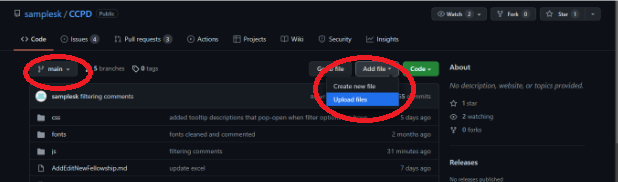
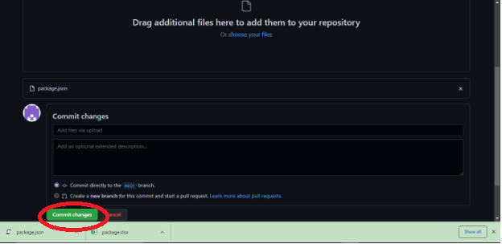

# How to Add/Update a Fellowship
#### The CCPD fellowships Google sheets: https://docs.google.com/spreadsheets/d/1WN6xjN9baqx9vf3Wit8rj0IxtzG85MTNEpdJXYlmuFU/edit <br/>

When editing or adding a fellowship to the SU CCPD fellowships site, it is important to modify both Sheet 1 and Sheet 2 in tandem and to make sure that both sheets are accurate (make sure that information on one sheet does not contradict the information on the other sheet). It is also important that you do not change any of the column names as that may break the website.

## Format to follow when editing Sheet 1:
Sheet 1 is how the fellowship information will be displayed to the website visitors. The format to follow is pretty lenient for this sheet:

### Strict guidelines to follow:
#### ** Do NOT change the column names**
```
- fellowship_id: the fellowship’s unique identifier
     - Make sure that when adding a new fellowship the fellowship_id column has a numerical value that no other fellowship has already been assigned.
     - We recommend following the increasing numerical order that has already been followed with the other fellowship_id values.
- Make sure that when removing a fellowship the entire row is deleted.
- If a fellowship does not offer any information about a column, leave the value blank under that column.
```
### Lenient guidelines:
```
The values on this sheet will be displayed on the webpage as is, so enter the values however you want them displayed:
- Grammar
- Punctuation
- Capitalization
```

## Format to follow when editing Sheet 2:
Sheet 2 is how the fellowship information will be read by the code. It will not be displayed on the website or viewed by the user. The format is very strict for this sheet, and it is vital that it is followed, or the webpage will not work properly:

### ** Do not change the column names**

#### fellowship_id: the fellowship’s unique identifier
- This column should automatically update with changes to sheet 1 with this formula that has already been applied to Google Sheets: =arrayformula(Sheet1!A:A).
- Make sure that the formula is still there and that the values match between both sheet 1 and sheet 2.
- This value should NEVER be blank.

#### name: the fellowship’s name
- This column should automatically update with changes to sheet 1 with this formula that has already been applied to Google Sheets: =arrayformula(Sheet1!B:B).
- Make sure that the formula is still there and that the values match between both sheet 1 and sheet 2.
- This value should NEVER be blank.

#### min_gpa: the minimum GPA that is required for a student to qualify for that fellowship
- This column should follow a decimal format (ex: 3.0).
- If the fellowship does not specify this information, then leave that value blank.

#### min_age_requirement: the minimum age requirement that allows a student to qualify for that fellowship.
- This column should follow a numerical format (ex: 18).
- If the fellowship does not specify this information, then leave that value blank.

#### max_age_requirement: the maximum age requirement that allows a student to qualify for that fellowship.
- This column should follow a numerical format (ex: 18).
- If the fellowship does not specify this information, leave that value blank.

#### location_of_study: the general location where a student can apply this fellowship.
There are 2 options for the values of this column:
```
- Domestic
  - The fellowship can only be applied to study domestically (within the United States).
- Abroad
  - The fellowship can only be applied to study abroad (outside the United States).
```
- If the fellowship can be applied to both Domestic and Abroad opportunities, leave that value blank.
- If the fellowship does not specify this information, leave that value blank.

#### citizenship_requirement: whether or not the fellowship requires certain citizenship/residency status for students to qualify.
There are 2 options for the values of this column:
```
- Yes
  - The fellowship does require the student to have a certain citizenship/residency status to qualify.
- No
  - The fellowship does NOT require the student to have a certain citizenship/residency status to qualify.
```
- If the fellowship does not specify this information, leave that value blank.

#### requires_campus_endorsement: whether or not the fellowship requires the student to be endorsed or nominated by the university:
There are 2 options for the values of this column:
```
- Yes
  - The fellowship does require the student to be nominated or endorsed to qualify.
- No
  - The fellowship does NOT require the student to be nominated or endorsed to qualify.
```
- If the fellowship does not specify this information, leave that value blank.

## Finalize Your Changes
Now that the Google Sheets have been updated, it is time to update the actual webpage with these changes:

1. Download the package Google Sheets as an excel spreadsheet file (package.xlxs)
2. Go to this URL: https://products.aspose.app/cells/conversion.
3. Upload the package.xlxs file that you downloaded on step 1.
4. Switch the “Save As” option from PDF to JSON.
5. Convert the excel file to JSON

6. Click the “Download Now” option to download the newly converted package.json file.
7. Make sure the file is named package.json. If it is not, rename it to package.json.
8. Go to the Github page for this project: https://github.com/samplesk/CCPD
9. Make sure the branch is on main, if it’s not, switch it to main:
10. Go to Add file
11. Click Upload files:

12. Drag and drop your package.json file into our project folder to replace it.
13. Click “Commit Changes”.

Done, the changes should now be fully deployed and displayed on the webpage :)